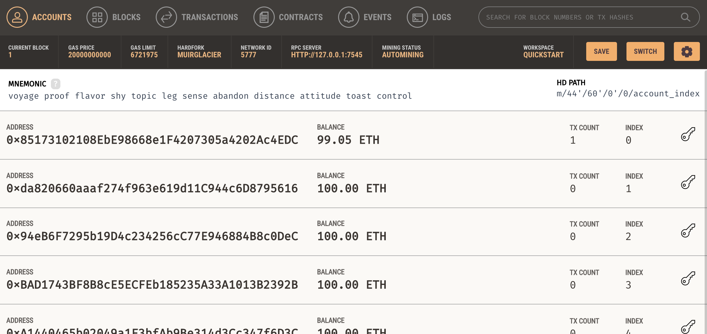
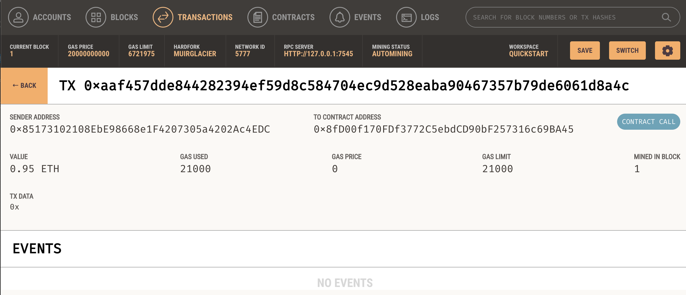
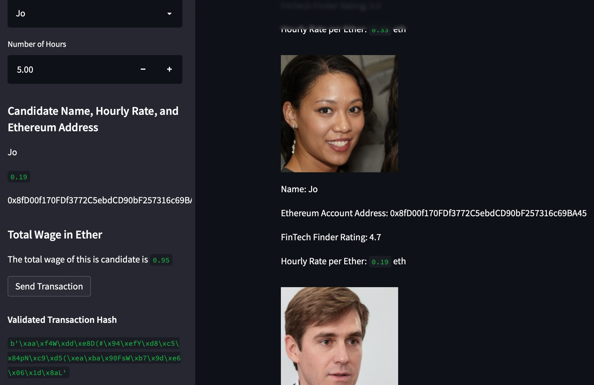

## Unit 19 Homework: Cryptocurrency Wallet

### Background

At our startup, we're building a new and disruptive platform called Fintech Finder. Fintech Finder is an application that its customers can use to find fintech professionals from among a list of candidates, hire them, and pay them. As Fintech Finder’s lead developer, you have been tasked with integrating the Ethereum blockchain network into the application in order to enable your customers to instantly pay the fintech professionals whom they hire with cryptocurrency.

In this application, we enable our customers to send cryptocurrency payments to fintech professionals. The idea is to develop the code and test it out, assuming the perspective of a Fintech Finder customer who is using the application to find a fintech professional and pay them for their work.

### What You're Creating

* A streamlit app
* a blockchain using Ganache

In this app, you can:

* Have an Ethereum account instance by using the mnemonic seed phrase provided by Ganache.

* Fetch and display the account balance associated with the Ethereum account address.

* Calculate the total value of an Ethereum transaction, including the gas estimate, that pays a Fintech Finder candidate for their work.

* Digitally sign a transaction that pays a Fintech Finder candidate, and send this transaction to the Ganache blockchain.

* Review the transaction hash code associated with the validated blockchain transaction.

You will receive the transaction’s hash code, with which, you can navigate to the Transactions section of Ganache to review the blockchain transaction details. To verify whether the transactions were successfully created, the screenshots are saved to the README.md file of your GitHub repository for this Challenge assignment.

* Screenshot of the address balance and history on Ganache. 

* Screenshot of the transaction details on Ganache. 

---

## Submission

* Upload the files for this assignment to your GitHub repository.

* Submit the link to your GitHub repo on Bootcamp Spot.

---

© 2021 Trilogy Education Services, a 2U, Inc. brand. All Rights Reserved.
